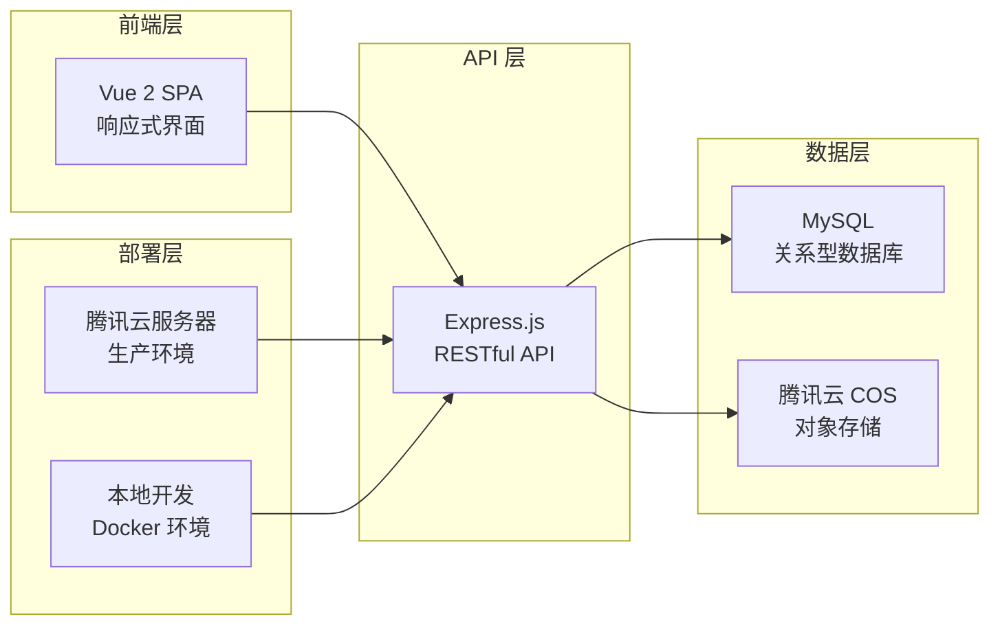

# CarDesignSpace 架构文档

本目录包含 CarDesignSpace 项目的完整架构文档，涵盖系统设计、部署方案、网络拓扑等核心架构信息。

## 📚 文档结构

### 核心架构文档
- [`project-overview.md`](./project-overview.md) - **项目架构总览**
  - 整体系统架构图
  - 核心组件说明
  - 技术栈概览
  - 数据流说明

- [`application-flow.md`](./application-flow.md) - **应用架构与数据流**
  - 详细的应用架构图
  - 前端-后端-数据库交互流程
  - 核心数据流时序图
  - 性能优化策略

- [`deployment-architecture.md`](./deployment-architecture.md) - **部署架构**
  - 生产环境部署架构
  - CI/CD 流水线设计
  - 监控与运维策略
  - 故障恢复方案

### 网络架构文档
- [`network-architecture/`](./network-architecture/) - **网络架构详细说明**
  - 内网环境拓扑
  - 云端服务连接
  - FRP 隧道配置
  - 域名解析策略

## 🏗️ 架构概览

CarDesignSpace 采用现代化的全栈架构设计：

## 🎯 架构特点

### 1. 分层架构设计
- **前端层**: Vue 2 SPA + Vuex 状态管理
- **API 层**: Express.js + 中间件模式
- **服务层**: 业务逻辑抽象
- **数据层**: Sequelize ORM + MySQL
- **存储层**: 腾讯云 COS 对象存储

### 2. 微服务化设计
- **认证服务**: JWT 用户认证
- **图片服务**: 图片处理与存储
- **车型服务**: 车型数据管理
- **标签服务**: 标签系统管理
- **上传服务**: 文件上传处理

### 3. 高可用设计
- **负载均衡**: Nginx 反向代理
- **数据备份**: 多重备份策略
- **监控告警**: 系统监控与日志
- **故障恢复**: 自动重启与回滚

### 4. 安全设计
- **网络安全**: 防火墙 + SSL 证书
- **应用安全**: JWT 认证 + CORS 控制
- **数据安全**: 加密存储 + 访问控制
- **审计日志**: 操作审计与监控

## 📊 技术栈

| 层级 | 技术选型 | 版本 | 说明 |
|------|----------|------|------|
| 前端 | Vue.js | 2.x | SPA 框架 |
| 前端 | Vuex | 3.x | 状态管理 |
| 前端 | Element UI | 2.x | UI 组件库 |
| 后端 | Node.js | 16+ | 运行时环境 |
| 后端 | Express.js | 4.x | Web 框架 |
| 后端 | Sequelize | 6.x | ORM 框架 |
| 数据库 | MySQL | 8.0 | 关系型数据库 |
| 存储 | 腾讯云 COS | - | 对象存储 |
| 部署 | Docker | 20+ | 容器化部署 |
| 部署 | Nginx | 1.18+ | Web 服务器 |
| 监控 | Winston | 3.x | 日志框架 |
| 进程 | PM2 | 5.x | 进程管理 |

## 🔄 数据流架构

### 用户请求流程
1. **用户访问** → Nginx 反向代理
2. **静态资源** → CDN 加速分发
3. **API 请求** → Express 后端处理
4. **数据查询** → Sequelize ORM
5. **数据返回** → MySQL 数据库
6. **响应返回** → 前端渲染展示

### 文件上传流程
1. **文件选择** → 前端文件选择器
2. **文件验证** → 类型和大小检查
3. **上传请求** → Express 上传接口
4. **文件处理** → Sharp 图片处理
5. **存储上传** → 腾讯云 COS
6. **元数据保存** → MySQL 数据库

### 数据同步流程
1. **定时任务** → ETL 数据同步
2. **外部数据** → DELL 数据源
3. **数据转换** → 格式标准化
4. **数据入库** → MySQL 存储
5. **索引更新** → 搜索索引重建
6. **缓存刷新** → Redis 缓存更新

## 🚀 部署架构

### 开发环境
- **本地开发**: Docker Compose
- **热重载**: nodemon + webpack-dev-server
- **数据库**: 本地 MySQL 实例
- **存储**: 本地文件系统

### 生产环境
- **服务器**: 腾讯云轻量服务器
- **域名**: cardesignspace.com
- **SSL**: Let's Encrypt 证书
- **CDN**: 腾讯云 CDN 加速
- **备份**: NAS + 云端双重备份

### CI/CD 流水线
- **代码仓库**: GitHub
- **自动化**: GitHub Actions
- **部署方式**: SSH 远程部署
- **回滚机制**: 版本标签回滚

## 📈 性能优化

### 前端优化
- **代码分割**: 按需加载组件
- **图片优化**: WebP 格式 + 懒加载
- **缓存策略**: 浏览器缓存 + CDN
- **压缩传输**: Gzip 压缩

### 后端优化
- **数据库**: 索引优化 + 查询优化
- **连接池**: 数据库连接复用
- **缓存**: Redis 缓存热点数据
- **压缩**: 响应数据压缩

### 存储优化
- **对象存储**: 腾讯云 COS 全球分发
- **图片处理**: 多尺寸自动生成
- **CDN 加速**: 全球节点分发
- **存储分层**: 热冷数据分离

## 🔧 运维监控

### 系统监控
- **CPU/内存**: 实时资源监控
- **磁盘空间**: 存储使用监控
- **网络流量**: 带宽使用监控
- **服务状态**: 进程健康检查

### 应用监控
- **API 性能**: 响应时间监控
- **错误日志**: 异常错误收集
- **用户行为**: 访问统计分析
- **数据库**: 查询性能监控

### 告警机制
- **阈值告警**: 资源使用告警
- **异常告警**: 服务异常告警
- **安全告警**: 安全事件告警
- **备份告警**: 备份失败告警

## 📋 相关文档

### 开发文档
- [后端架构详细说明](../development/backend-architecture.md)
- [数据库架构详细说明](../development/database-architecture.md)
- [后端优化指南](../development/backend-optimization.md)

### 部署文档
- [腾讯云部署指南](../deployment/tencent-cloud.md)
- [Ubuntu 部署指南](../deployment/ubuntu.md)

### 运维文档
- [防爬虫指南](../operations/anti-crawler-guide.md)
- [NAS 存储指南](../operations/nas-s3-storage-guide.md)
- [GitHub Actions 配置](../operations/github-actions-setup.md)

### 功能文档
- [图片标签系统](../features/image-tagging-guide.md)
- [右键菜单功能](../features/context-menu-right-click.md)
- [图片画廊功能](../features/image-gallery-feature.md)

---

*最后更新: 2025-01-02*  
*文档版本: v2.0*

