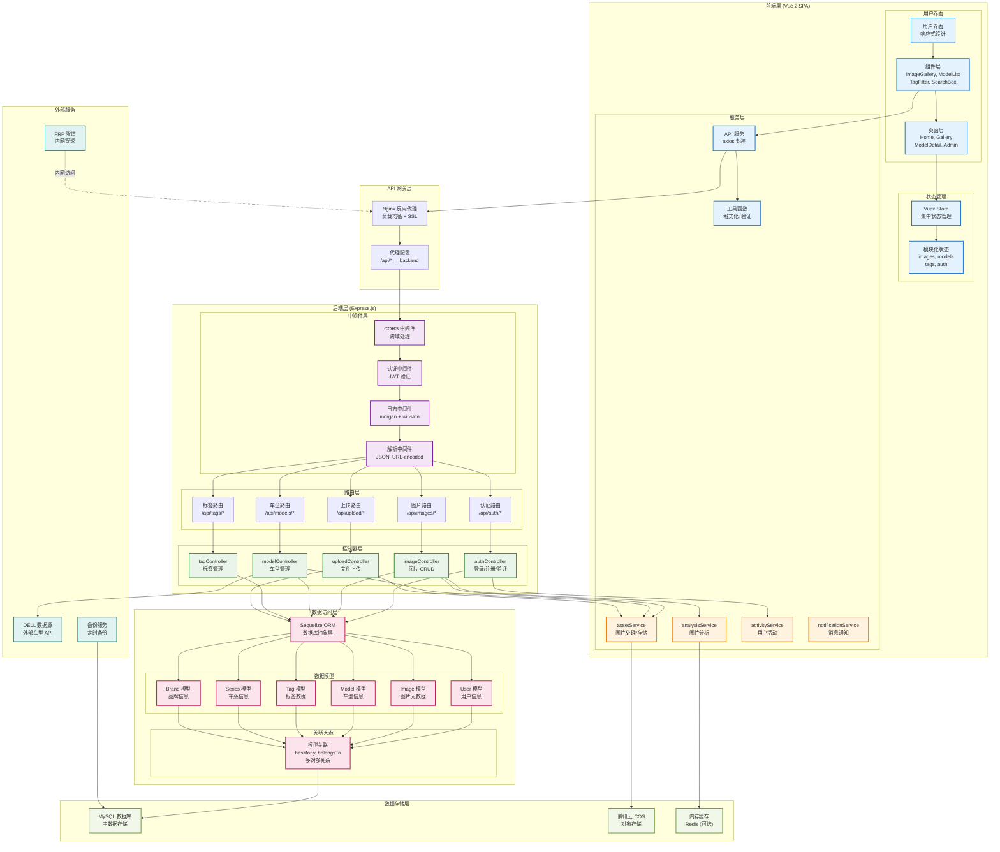
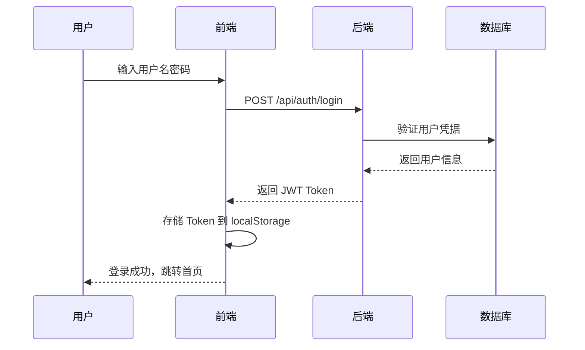
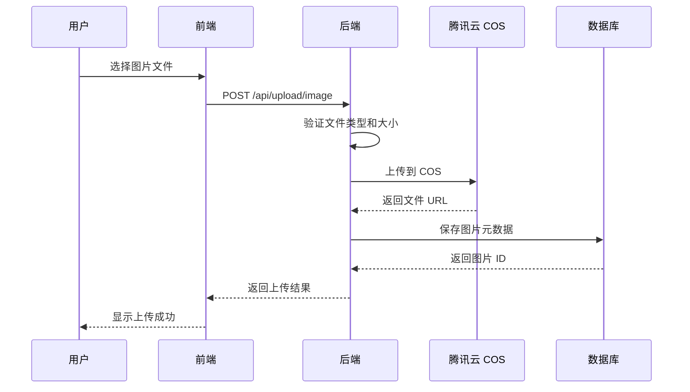
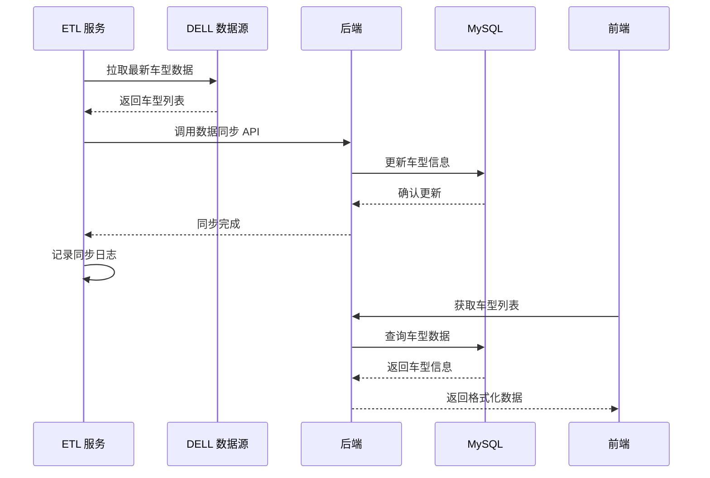

# CarDesignSpace 应用架构与数据流

本文档详细描述 CarDesignSpace 应用的核心架构和数据流转过程。

## 应用架构图

## 核心数据流

### 1. 用户认证流程

### 2. 图片上传流程

### 3. 车型数据同步流程

## 关键技术实现

### 前端架构特点
- **组件化设计**: 可复用的 UI 组件库
- **状态管理**: Vuex 集中式状态管理
- **路由管理**: Vue Router 单页面应用路由
- **响应式设计**: 适配不同设备屏幕

### 后端架构特点
- **分层架构**: 控制器-服务-数据访问层分离
- **中间件模式**: 可插拔的中间件系统
- **ORM 抽象**: Sequelize 数据库抽象层
- **RESTful API**: 标准化的 API 设计

### 数据架构特点
- **关系型设计**: MySQL 关系型数据库
- **对象存储**: 腾讯云 COS 文件存储
- **数据同步**: ETL 外部数据源集成
- **备份策略**: 多重备份保障数据安全

## 性能优化策略

1. **前端优化**
   - 组件懒加载
   - 图片懒加载
   - API 请求缓存
   - 静态资源压缩

2. **后端优化**
   - 数据库索引优化
   - 查询语句优化
   - 连接池管理
   - 缓存策略

3. **存储优化**
   - 图片压缩和格式转换
   - CDN 加速
   - 分片上传
   - 存储分层

## 相关文档

- [项目架构总览](./project-overview.md)
- [网络架构详细说明](./network-architecture/network-architecture-analysis.md)
- [后端架构详细说明](../development/backend-architecture.md)
- [数据库架构详细说明](../development/database-architecture.md)
