# CarDesignSpace 部署架构

本文档详细描述 CarDesignSpace 在生产环境的部署架构和运维策略。

## 部署架构图


## 部署环境说明

### 生产环境 (腾讯云轻量服务器)
- **服务器配置**: 2核4GB，40GB SSD
- **操作系统**: Ubuntu 20.04 LTS
- **公网 IP**: 124.221.249.173
- **域名**: cardesignspace.com

### 服务端口配置
```yaml
# 生产环境端口映射
nginx: 80/443 (HTTP/HTTPS)
backend: 3000 (内部端口)
mysql: 3306 (内部端口)
redis: 6379 (内部端口)
```

### 内网环境
- **Dell 工作站**: 192.168.31.119 (开发环境)
- **群晖 NAS**: 192.168.31.150 (存储与备份)
- **路由器**: 192.168.31.1 (内网网关)

## 部署流程

### 1. 自动化部署流程


### 2. 手动部署流程
```bash
# 1. 连接到生产服务器
ssh root@124.221.249.173

# 2. 进入项目目录
cd /opt/cardesignspace

# 3. 拉取最新代码
git pull origin main

# 4. 安装依赖
cd backend && npm install
cd ../frontend && npm install

# 5. 构建前端
npm run build

# 6. 重启后端服务
pm2 restart backend

# 7. 重新加载 Nginx
nginx -s reload
```

## 监控与运维

### 1. 系统监控
- **CPU 使用率**: 实时监控服务器 CPU 负载
- **内存使用率**: 监控内存使用情况
- **磁盘空间**: 定期检查磁盘使用率
- **网络流量**: 监控入站和出站流量

### 2. 应用监控
- **服务状态**: PM2 进程管理监控
- **数据库连接**: MySQL 连接池监控
- **API 响应时间**: 接口性能监控
- **错误日志**: 应用错误日志收集

### 3. 备份策略

```mermaid
gantt
    title 备份策略时间表
    dateFormat HH:mm
    axisFormat %H:%M
    
    section 数据库备份
    每日全量备份    :active, db1, 02:00, 1h
    每小时增量备份  :db2, 03:00, 30m
    
    section 文件备份
    每日文件同步    :file1, 04:00, 2h
    每周归档备份    :file2, 05:00, 3h
    
    section 配置备份
    每日配置备份    :config1, 06:00, 30m
    每周配置归档    :config2, 07:00, 1h
```


### 4. 日志管理
- **应用日志**: Winston 日志轮转
- **访问日志**: Nginx 访问日志
- **错误日志**: 系统错误日志收集
- **审计日志**: 用户操作审计

## 安全策略

### 1. 网络安全
- **防火墙**: UFW 防火墙配置
- **SSL 证书**: Let's Encrypt 自动续期
- **访问控制**: IP 白名单限制
- **DDoS 防护**: 腾讯云 DDoS 防护

### 2. 应用安全
- **JWT 认证**: 用户身份验证
- **CORS 配置**: 跨域请求控制
- **输入验证**: 参数验证和过滤
- **SQL 注入防护**: 参数化查询

### 3. 数据安全
- **数据加密**: 敏感数据加密存储
- **备份加密**: 备份文件加密
- **访问控制**: 数据库用户权限管理
- **审计日志**: 数据访问审计

## 性能优化

### 1. 前端优化
- **静态资源**: CDN 加速
- **图片优化**: WebP 格式转换
- **代码分割**: 按需加载
- **缓存策略**: 浏览器缓存

### 2. 后端优化
- **数据库索引**: 查询性能优化
- **连接池**: 数据库连接复用
- **缓存策略**: Redis 缓存
- **压缩传输**: Gzip 压缩

### 3. 存储优化
- **对象存储**: 腾讯云 COS
- **图片处理**: 多尺寸生成
- **CDN 加速**: 全球节点分发
- **存储分层**: 热冷数据分离

## 故障恢复

### 1. 服务恢复
- **自动重启**: PM2 自动重启
- **健康检查**: 服务健康检查
- **故障转移**: 备用服务切换
- **回滚机制**: 快速版本回滚

### 2. 数据恢复
- **数据库恢复**: 从备份恢复数据
- **文件恢复**: 从 COS 恢复文件
- **配置恢复**: 从备份恢复配置
- **完整恢复**: 系统完整恢复流程

## 相关文档

- [项目架构总览](./project-overview.md)
- [应用架构与数据流](./application-flow.md)
- [网络架构详细说明](./network-architecture/network-architecture-analysis.md)
- [腾讯云部署指南](../deployment/tencent-cloud.md)
- [Ubuntu 部署指南](../deployment/ubuntu.md)

