# 网络架构分析报告
> 生成时间: 2025-08-09  
> 版本: v1.0  
> 作者: 系统分析

## 📋 架构概述

本文档详细记录了Dell工作站、群晖NAS和腾讯云服务器之间的完整网络架构，包括物理连接、服务部署、域名配置和数据流分析。

## 🏗️ 物理网络拓扑

### 网络环境
- **内网段**: 192.168.31.0/24
- **网关设备**: 小米路由器 AX3000 (192.168.31.1)
- **连接方式**: 全部有线连接
- **端口转发**: 未配置路由器端口转发

### 设备清单

#### Dell工作站 (BM-Precision7560)
- **IP地址**: 192.168.31.119
- **操作系统**: Windows
- **用户**: dell@BM-Precision7560
- **连接方式**: 有线连接到路由器
- **SSH密钥**: C:\Users\dell\.ssh\id_ed25519

#### 群晖NAS (BM_NAS)
- **主IP**: 192.168.31.150
- **辅助IP**: 192.168.1.3
- **IPv6**: 2408:820c:8238:da50::150
- **系统**: 群晖 DSM 7.x (Linux 4.4.302+)
- **连接方式**: 有线连接到路由器
- **Docker**: v24.0.2

#### 腾讯云服务器
- **公网IP**: 124.221.249.173
- **实例ID**: lhins-0ouh7c6a
- **类型**: 腾讯云轻量应用服务器
- **用户**: root, lighthouse

## 🌐 域名和DNS配置

### 域名解析记录 (DNSPod)

#### birdmanoutman.com
```
@     A     124.221.249.173    600s
www   A     124.221.249.173    600s
nas   AAAA  2408:820c:8238:da50::150    600s
```

#### xiaomishuppt.com
```
@     A     124.221.249.173    600s
www   A     124.221.249.173    600s
@     MX    mxbiz1.qq.com.    (优先级: 5)
@     MX    mxbiz2.qq.com.    (优先级: 10)
@     TXT   v=spf1 include:spf.mail.qq.com ~all
```

#### maydayland.fans
```
仅配置NS记录，暂无A记录解析
```

#### birdmanoutman.synology.me
```
群晖DDNS服务，解析到 124.221.249.173
```

## 🔧 服务部署架构

### Dell工作站服务 (192.168.31.119)

#### 应用服务
| 服务名称 | 端口 | 技术栈 | 用途 | frp映射端口 |
|---------|------|-------|------|-------------|
| 小秘书PPT前端 | 2342 | Office.js | PPT侧加载项 | 44300 |
| 小秘书PPT后端 | 2343 | Node.js API | 后端服务 | 44301 |
| 个人网站 | 2344 | 待开发 | 个人展示 | 44302 |
| ComfyUI | 2345 | Python/AI | 图像处理 | 44305 |
| 远程桌面 | 3380 | RDP | 远程访问 | 41429 |
| 静态文件 | - | File Server | 文件共享 | 6443 |

#### frp客户端配置
```toml
# 配置文件: docs/frpc-dell.toml
serverAddr = "124.221.249.173"
serverPort = 7000
token = "SFPcohVhPSlzbovC"
```

### 群晖NAS服务 (192.168.31.150)

#### 系统服务
| 服务名称 | 端口 | 描述 | 访问方式 |
|---------|------|------|---------|
| DSM管理 | 5000/5001 | 系统管理界面 | HTTP/HTTPS |
| Web Station | 80/443 | nginx反向代理 | HTTP/HTTPS |
| MinIO S3 | 9000 | 对象存储API | HTTP |
| MinIO Console | 9001 | Web管理界面 | HTTP |

#### Docker容器
```bash
# 运行中的容器
NAMES                  IMAGE                                     STATUS
minio                  docker.m.daocloud.io/minio/minio:latest   Up 16 hours
synology_docviewer_2   05f0258f226c                             Up 23 hours
synology_docviewer_1   05f0258f226c                             Up 23 hours
```

#### MinIO配置
```bash
# 存储路径: /volume1/docker/minio-data
# 访问密钥: 2ajE2U8US6DZ1PbLc020
# 密钥: HSrdmZv125hsP3ZHbfMJeFUyTmSfkcJhb2TiYkxc
# 网络模式: host
```

#### frp客户端配置
```toml
# 配置文件: /volume1/docker/frpc.toml
serverAddr = "124.221.249.173"
serverPort = 7000
token = "SFPcohVhPSlzbovC"

# 映射端口
HTTP: 80 -> 80
HTTPS: 443 -> 443
MinIO S3: 9000 -> 39000
MinIO Console: 9001 -> 39001
```

### 腾讯云服务器 (124.221.249.173)

#### frp服务器配置
```yaml
控制端口: 7000
管理面板: 5443
用户: birdmanoutman
密码: 12345687!
认证令牌: SFPcohVhPSlzbovC
日志级别: info
日志保留: 3天
```

#### Nginx反向代理
```bash
配置路径: /etc/nginx/conf.d/
主要配置: pptaddin.conf
SSL证书: 自动管理
```

#### 端口映射表
| 源设备 | 本地端口 | 云端端口 | 服务描述 |
|-------|----------|----------|----------|
| Dell | 2342 | 44300 | 小秘书PPT前端 |
| Dell | 2343 | 44301 | 小秘书PPT后端 |
| Dell | 2344 | 44302 | 个人网站 |
| Dell | 2345 | 44305 | ComfyUI |
| Dell | 3380 | 41429 | 远程桌面 |
| Dell | 文件 | 6443 | 静态文件 |
| NAS | 80 | 80 | Web服务 |
| NAS | 443 | 443 | HTTPS服务 |
| NAS | 9000 | 39000 | MinIO S3 |
| NAS | 9001 | 39001 | MinIO Console |

## 🔄 数据流和访问路径

### 外网访问流程
1. **域名解析**: 用户访问域名 → DNSPod解析 → 124.221.249.173
2. **入口代理**: 腾讯云Nginx → 根据配置转发到对应端口
3. **隧道转发**: frp服务器 → 通过隧道转发到本地frp客户端
4. **本地服务**: Dell工作站或NAS上的具体应用服务

### 特殊访问路径

#### IPv6直连 (推荐)
```
用户 → nas.birdmanoutman.com → 2408:820c:8238:da50::150 → NAS直连
优势: 低延迟，无需经过腾讯云转发
```

#### 内网访问 (最高性能)
```
内网设备 → 192.168.31.150:9001 → MinIO直连
内网设备 → 192.168.31.119:2342 → 小秘书PPT直连
```

#### frp隧道访问 (跨网络)
```
外网用户 → 域名 → 腾讯云 → frp隧道 → 本地服务
适用场景: 外网用户访问内网服务
```

## 🛡️ 安全配置

### 认证方式
- **SSH密钥**: Dell工作站 ↔ 腾讯云 (已配置)
- **frp令牌**: 统一认证令牌 "SFPcohVhPSlzbovC"
- **SSL证书**: 腾讯云nginx自动管理

### 防火墙策略
- **腾讯云**: 安全组规则管理
- **本地网络**: 路由器防火墙 + 设备防火墙
- **应用层**: 各服务独立的访问控制

## 📊 性能监控

### 关键指标
- **frp隧道状态**: 实时连接监控
- **带宽使用**: 腾讯云出入流量
- **延迟测试**: IPv6直连 vs frp隧道
- **服务可用性**: 各端口健康检查

### 监控工具
- **frp管理面板**: http://124.221.249.173:5443
- **MinIO监控**: 内置监控面板
- **系统监控**: 群晖DSM资源监控

## ⚡ 优化建议

### 1. 架构优化 (优先级: 高)

#### 域名合并和SSL统一管理
```
当前问题: 多个域名分散管理，SSL证书配置复杂
解决方案:
- 使用通配符SSL证书 (*.birdmanoutman.com)
- 统一子域名策略:
  - ppt.birdmanoutman.com (小秘书PPT)
  - img.birdmanoutman.com (MinIO/图片服务)
  - api.birdmanoutman.com (API服务)
  - nas.birdmanoutman.com (NAS服务)
```

#### 服务迁移策略
```
短期目标:
- MinIO迁移到群晖Web Station反向代理 ✅ (进行中)
- 移除frp中的MinIO端口映射 (39000/39001)

中期目标:
- 考虑将ComfyUI迁移到NAS Docker
- 优化Dell工作站的服务分布

长期目标:
- 实现服务的容器化部署
- 建立CI/CD自动部署流程
```

### 2. 性能优化 (优先级: 中)

#### CDN和缓存策略
```
实施方案:
- 腾讯云CDN或Cloudflare加速
- 静态资源缓存优化
- 图片服务缓存策略
```

#### 网络路径优化
```
IPv6直连优化:
- 扩大IPv6直连服务范围
- 优化IPv6路由配置
- 实现智能路由选择

frp隧道优化:
- 启用TLS加密
- 优化隧道压缩
- 实现负载均衡
```

### 3. 安全加固 (优先级: 高)

#### 网络安全
```
加密传输:
- frp隧道TLS加密启用
- 内网HTTP → HTTPS迁移
- API接口安全认证

访问控制:
- 实施IP白名单
- 服务访问权限细化
- 审计日志记录
```

#### 证书管理
```
自动化方案:
- Let's Encrypt自动续期
- 证书集中管理
- 过期监控告警
```

### 4. 运维优化 (优先级: 中)

#### 监控和告警
```
监控指标:
- 服务可用性监控
- 性能指标收集
- 错误日志分析

告警机制:
- 服务宕机告警
- 资源使用告警
- 安全事件告警
```

#### 备份和恢复
```
数据备份:
- MinIO数据定期备份
- 配置文件版本控制
- 系统快照策略

灾难恢复:
- 服务快速恢复流程
- 配置一键部署
- 数据恢复验证
```

### 5. 成本优化 (优先级: 低)

#### 资源使用优化
```
带宽优化:
- 监控流量使用模式
- 优化大文件传输
- 实施流量控制

服务整合:
- 评估低使用率服务
- 合并相似功能服务
- 优化端口映射数量
```

## 📈 实施路线图

### 第一阶段 (1-2周)
- [ ] 完成MinIO Web Station迁移
- [ ] 更新frp配置，移除冗余映射
- [ ] 实施SSL证书统一管理
- [ ] 配置基础监控告警

### 第二阶段 (2-4周)
- [ ] 域名策略统一和子域名规划
- [ ] IPv6直连服务扩展
- [ ] 安全策略加固
- [ ] 性能监控完善

### 第三阶段 (1-2月)
- [ ] CDN实施和优化
- [ ] 服务容器化改造
- [ ] CI/CD流程建立
- [ ] 备份恢复策略完善

## 📝 维护清单

### 日常维护
- [ ] 检查frp隧道连接状态
- [ ] 监控服务可用性
- [ ] 查看错误日志
- [ ] 备份关键配置

### 定期维护
- [ ] SSL证书更新检查
- [ ] 系统安全更新
- [ ] 性能指标分析
- [ ] 容量规划评估

### 应急响应
- [ ] 服务故障处理流程
- [ ] 网络连接问题诊断
- [ ] 数据恢复操作
- [ ] 安全事件响应

---

## 附录

### A. 配置文件位置
- Dell frp配置: `docs/frpc-dell.toml`
- NAS frp配置: `/volume1/docker/frpc.toml`
- 腾讯云frp配置: `/usr/local/frps/`
- Nginx配置: `/etc/nginx/conf.d/`
- DNS记录: `docs/dnspod_records_2025-08-09_14-54-14/`

### B. 关键命令
```bash
# 连接NAS
ssh birdmanoutman@2408:820c:8238:da50::150

# 检查frp状态
ps aux | grep frp

# 重启MinIO
docker restart minio

# 检查端口监听
netstat -tlnp | grep :9001
```

### C. 故障排查指南
1. **frp隧道断开**: 检查网络连接和认证令牌
2. **服务无法访问**: 验证端口映射和防火墙规则
3. **SSL证书问题**: 检查证书有效期和配置
4. **性能问题**: 分析网络路径和资源使用

---
*文档最后更新: 2025-08-09*

```mermaid
graph TB
    subgraph "本地网络环境 (192.168.31.0/24)"
        subgraph "小米路由器 AX3000<br/>192.168.31.1"
            ROUTER["小米路由器 AX3000<br/>网关: 192.168.31.1<br/>无端口转发配置"]
        end
        
        subgraph "Dell工作站<br/>BM-Precision7560<br/>192.168.31.119"
            DELL["Dell PC (Windows)<br/>IP: 192.168.31.119<br/>用户: dell<br/>有线连接"]
            DELL_FRPC["frp客户端<br/>frpc-dell.toml"]
            
            subgraph "Dell本地服务"
                PPT_FE["小秘书PPT前端<br/>Office.js侧加载项<br/>端口: 2342<br/>→ 云端: 44300"]
                PPT_BE["小秘书PPT后端<br/>API服务<br/>端口: 2343<br/>→ 云端: 44301"]
                PERSONAL["个人网站<br/>端口: 2344<br/>→ 云端: 44302<br/>(待开发)"]
                COMFYUI["ComfyUI<br/>图像处理服务<br/>端口: 2345<br/>→ 云端: 44305"]
                RDP["远程桌面<br/>端口: 3380<br/>→ 云端: 41429"]
                STATIC["静态文件服务<br/>C:/Users/dell/Desktop/share<br/>→ 云端: 6443"]
            end
        end
        
        subgraph "群晖NAS<br/>BM_NAS<br/>192.168.31.150"
            NAS["群晖 DSM 7.x<br/>主IP: 192.168.31.150<br/>辅IP: 192.168.1.3<br/>IPv6: 2408:820c:8238:da50::150<br/>有线连接"]
            NAS_FRPC["frp客户端<br/>frpc.toml"]
            
            subgraph "NAS服务"
                DSM["DSM管理界面<br/>端口: 5000/5001"]
                WEBSTATION["Web Station<br/>nginx反向代理<br/>端口: 80/443"]
                DOCKER["Docker Engine 24.0.2"]
                
                subgraph "Docker容器"
                    MINIO["MinIO对象存储<br/>S3 API: 9000 → 39000<br/>Web Console: 9001 → 39001<br/>存储: /volume1/docker/minio-data<br/>ACCESS_KEY: 2ajE2U8***"]
                    DOCVIEWER["Synology DocViewer<br/>(2个实例运行中)"]
                end
            end
        end
    end
    
    subgraph "腾讯云轻量服务器<br/>124.221.249.173"
        CLOUD["腾讯云 Lighthouse<br/>实例: lhins-0ouh7c6a<br/>公网IP: 124.221.249.173"]
        
        subgraph "云端服务"
            FRPS["frp服务器<br/>控制端口: 7000<br/>管理面板: 5443<br/>用户: birdmanoutman<br/>令牌: SFPcohVhPSlzbovC"]
            NGINX_CLOUD["Nginx反向代理<br/>配置: /etc/nginx/conf.d/<br/>SSL: 自动管理"]
            
            subgraph "端口映射服务"
                CLOUD_RDP["Dell RDP<br/>端口: 41429"]
                CLOUD_PPT_FE["小秘书PPT前端<br/>端口: 44300"]
                CLOUD_PPT_BE["小秘书PPT后端<br/>端口: 44301"]
                CLOUD_PERSONAL["个人网站<br/>端口: 44302"]
                CLOUD_COMFYUI["ComfyUI服务<br/>端口: 44305"]
                CLOUD_STATIC["静态文件<br/>端口: 6443"]
                CLOUD_MINIO_S3["MinIO S3<br/>端口: 39000"]
                CLOUD_MINIO_WEB["MinIO Console<br/>端口: 39001"]
                CLOUD_WEB["Web服务<br/>端口: 80/443"]
            end
        end
    end
    
    subgraph "DNS解析系统 (腾讯云DNSPod)"
        DNSPOD["腾讯云DNSPod<br/>DNS解析服务"]
        
        subgraph "域名配置"
            DOMAIN1["birdmanoutman.com<br/>@ A 124.221.249.173<br/>www A 124.221.249.173<br/>nas AAAA 2408:820c:8238:da50::150"]
            DOMAIN2["xiaomishuppt.com<br/>@ A 124.221.249.173<br/>www A 124.221.249.173<br/>邮箱: QQ企业邮箱<br/>MX: mxbiz1.qq.com (5)<br/>MX: mxbiz2.qq.com (10)"]
            DOMAIN3["maydayland.fans<br/>仅NS记录<br/>暂无A记录解析"]
            DOMAIN4["birdmanoutman.synology.me<br/>群晖DDNS<br/>→ 124.221.249.173"]
        end
    end
    
    subgraph "外网访问"
        INTERNET["互联网用户"]
        subgraph "访问方式"
            HTTP_ACCESS["HTTP/HTTPS访问<br/>通过域名<br/>经腾讯云代理"]
            IPV6_ACCESS["IPv6直连<br/>nas.birdmanoutman.com<br/>低延迟访问"]
            FRP_ACCESS["frp隧道<br/>跨网络访问<br/>认证加密"]
        end
    end
    
    %% 内网连接关系
    DELL -.->|"有线千兆连接"| ROUTER
    NAS -.->|"有线千兆连接"| ROUTER
    
    %% frp隧道连接
    DELL_FRPC ==>|"frp隧道<br/>TLS加密<br/>令牌认证"| FRPS
    NAS_FRPC ==>|"frp隧道<br/>TLS加密<br/>令牌认证"| FRPS
    
    %% Dell服务映射
    PPT_FE --> DELL_FRPC
    PPT_BE --> DELL_FRPC
    PERSONAL --> DELL_FRPC
    COMFYUI --> DELL_FRPC
    RDP --> DELL_FRPC
    STATIC --> DELL_FRPC
    
    %% NAS服务映射
    MINIO --> NAS_FRPC
    DSM --> NAS_FRPC
    WEBSTATION --> NAS_FRPC
    
    %% 云端服务映射
    FRPS --> CLOUD_RDP
    FRPS --> CLOUD_PPT_FE
    FRPS --> CLOUD_PPT_BE
    FRPS --> CLOUD_PERSONAL
    FRPS --> CLOUD_COMFYUI
    FRPS --> CLOUD_STATIC
    FRPS --> CLOUD_MINIO_S3
    FRPS --> CLOUD_MINIO_WEB
    FRPS --> CLOUD_WEB
    
    %% DNS解析连接
    INTERNET --> DNSPOD
    DNSPOD --> DOMAIN1
    DNSPOD --> DOMAIN2
    DNSPOD --> DOMAIN3
    DNSPOD --> DOMAIN4
    
    %% 外网访问路径
    HTTP_ACCESS --> NGINX_CLOUD
    NGINX_CLOUD --> CLOUD_PPT_FE
    NGINX_CLOUD --> CLOUD_PPT_BE
    NGINX_CLOUD --> CLOUD_PERSONAL
    
    IPV6_ACCESS -.->|"IPv6直连<br/>绕过云端代理"| NAS
    FRP_ACCESS --> FRPS
    
    %% Docker内部关系
    DOCKER --> MINIO
    DOCKER --> DOCVIEWER
    
    %% Web Station到MinIO的反向代理
    WEBSTATION -.->|"计划中的反向代理<br/>替代frp映射"| MINIO
    
    %% 数据流标注
    MINIO -.->|"S3对象存储<br/>图片/文件服务"| COMFYUI
    COMFYUI -.->|"图像处理服务"| PPT_BE
    PPT_BE -.->|"API调用"| PPT_FE
    
    %% 样式定义
    classDef localDevice fill:#e3f2fd,stroke:#1976d2,stroke-width:2px,color:#000
    classDef cloudDevice fill:#fff3e0,stroke:#f57c00,stroke-width:2px,color:#000
    classDef service fill:#f3e5f5,stroke:#7b1fa2,stroke-width:1px,color:#000
    classDef network fill:#e8f5e8,stroke:#388e3c,stroke-width:2px,color:#000
    classDef domain fill:#fff8e1,stroke:#ffa000,stroke-width:1px,color:#000
    classDef container fill:#e0f2f1,stroke:#00695c,stroke-width:1px,color:#000
    classDef router fill:#fce4ec,stroke:#c2185b,stroke-width:2px,color:#000
    classDef critical fill:#ffebee,stroke:#d32f2f,stroke-width:2px,color:#000
    
    class DELL,NAS localDevice
    class CLOUD,FRPS,NGINX_CLOUD cloudDevice
    class PPT_FE,PPT_BE,PERSONAL,COMFYUI,RDP,STATIC,DSM,WEBSTATION,DELL_FRPC,NAS_FRPC service
    class INTERNET,HTTP_ACCESS,IPV6_ACCESS,FRP_ACCESS,DNSPOD network
    class DOMAIN1,DOMAIN2,DOMAIN3,DOMAIN4 domain
    class MINIO,DOCVIEWER,DOCKER container
    class ROUTER router
    class CLOUD_RDP,CLOUD_PPT_FE,CLOUD_PPT_BE,CLOUD_PERSONAL,CLOUD_COMFYUI,CLOUD_STATIC,CLOUD_MINIO_S3,CLOUD_MINIO_WEB,CLOUD_WEB critical
```


