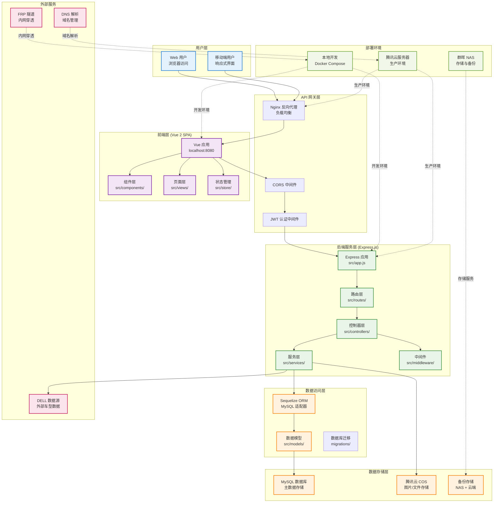

# CarDesignSpace 项目架构总览

本文档提供 CarDesignSpace 项目的整体架构概览，包括系统组件、数据流、部署架构等核心信息。

## 项目架构图

## 核心组件说明

### 前端架构 (Vue 2 SPA)
- **应用入口**: `frontend/src/main.js`
- **组件系统**: `src/components/` - 可复用 UI 组件
- **页面路由**: `src/views/` - 页面级组件
- **状态管理**: `src/store/` - Vuex 状态管理
- **构建工具**: Vue CLI + Webpack

### 后端架构 (Express.js)
- **应用入口**: `backend/src/app.js`
- **路由层**: `src/routes/` - API 路由定义
- **控制器**: `src/controllers/` - 业务逻辑处理
- **服务层**: `src/services/` - 核心业务服务
- **中间件**: `src/middleware/` - 认证、日志等中间件
- **数据模型**: `src/models/` - Sequelize 模型定义

### 数据架构
- **主数据库**: MySQL - 存储用户、图片、标签等核心数据
- **文件存储**: 腾讯云 COS - 图片和文件对象存储
- **外部数据**: DELL 数据库 - 车型数据源
- **备份策略**: NAS + 云端双重备份

### 部署架构
- **开发环境**: Docker Compose 本地开发
- **生产环境**: 腾讯云轻量服务器
- **网络穿透**: FRP 隧道服务
- **域名管理**: DNS 解析服务

## 数据流说明

1. **用户请求流**: 用户 → Nginx → Vue 前端 → Express API → 数据库
2. **文件上传流**: 前端 → API → 腾讯云 COS → 数据库记录
3. **数据同步流**: DELL 数据源 → ETL 服务 → MySQL → 前端展示
4. **备份流**: MySQL → 定时备份 → NAS 存储 → 云端备份

## 技术栈

- **前端**: Vue 2, Vuex, Vue Router, Element UI
- **后端**: Node.js, Express.js, Sequelize ORM
- **数据库**: MySQL 8.0
- **存储**: 腾讯云 COS
- **部署**: Docker, Nginx, FRP
- **监控**: Winston 日志, 自定义监控脚本

## 相关文档

- [网络架构详细说明](./network-architecture/network-architecture-analysis.md)
- [后端架构详细说明](../development/backend-architecture.md)
- [数据库架构详细说明](../development/database-architecture.md)
- [部署指南](../deployment/)

