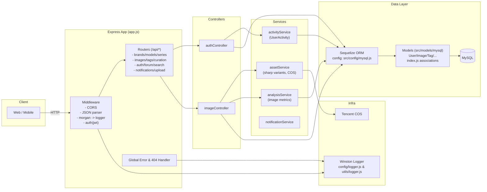

# 后端架构（2025 版）

本文件描述当前后端的总体架构、分层职责、典型调用链、关键数据模型、外部依赖与环境变量，以及已知风险与改进建议。面向后端开发、全栈开发与运维同学。

## 架构图

## 分层与职责

- 应用层（入口）
  - 文件：`backend/src/app.js`
  - 职责：装配中间件（CORS/JSON/morgan）、静态目录、健康检查、路由挂载、全局错误与 404 处理、启动监听与数据库连接。

- 鉴权层（中间件）
  - 文件：`backend/src/middleware/auth.js`
  - 职责：`authenticateToken` 强制鉴权；`optionalAuth` 可选鉴权（支持未登录访问），在通过 JWT 验证后注入 `req.user`。

- 路由层
  - 目录：`backend/src/routes/`
  - 职责：根据业务域拆分路由：`auth.js`、`imageRoutes.js`/`imagesRoutesV2.js`、`brandRoutes.js`、`seriesRoutes.js`、`modelRoutes.js`、`tagRoutes.js`、`curationRoutes.js`、`forumRoutes.js`、`searchRoutes.js`、`notificationRoutes.js`、`upload.js`。

- 控制器层
  - 目录：`backend/src/controllers/`
  - 示例：`authController.js`（注册/登录/登出/资料/积分/成就/排名）、`imageController.js`（按车型分页、详情、热门、收藏/取消收藏、HD 取图）。
  - 职责：请求参数校验、编排服务与模型、拼装响应。

- 服务层
  - `assetService.js`：基于 sharp 生成多变体（thumb/small/medium/large/webp），上传腾讯云 COS，`ImageAsset.upsert` 持久化；提供 `chooseBestUrl` 以统一前端最佳取图策略。
  - `analysisService.js`：输出基础图像分析（主色、长宽比、简化质量分），写入 `ImageAnalysis`。
  - `activityService.js`：统一记录用户行为流水 `UserActivity`（注册/登录/登出/上传/下载/资料更新/成就等）。
  - （预留）通知、搜索、精选等服务组件。

- 数据访问层
  - ORM：`backend/src/config/mysql.js` 暴露 `sequelize` 与 `connectMySQL()`；（注意：`backend/src/config/database.js` 有重复配置，建议合并统一）。
  - 模型：`backend/src/models/mysql/*.js` 定义实体；`backend/src/models/mysql/index.js` 统一声明跨表关联（品牌/车系/车型/图片/资产/精选/分析/统计/标签、论坛与通知等）。

- 基础设施
  - 对象存储：`backend/src/config/cos.js`（COS SDK 初始化、`uploadToCOS`/`deleteFromCOS`、`generateUploadPath` 与 `Model`/`Brand` 协作生成目录）。
  - 日志：`backend/src/config/logger.js` 与 `backend/utils/logger.js`（Winston，文件+控制台，按环境分级；morgan 定向输出到 logger）。

## 典型调用链

- 公共列表（未登录可访问）
  - `Client -> GET /api/images?modelId=:id -> imagesRoutesV2 -> imageController.getImagesByModelId`
  - 逻辑：分页查询 `Image`，联接 `ImageAsset`、`ImageCuration`，按精选与时间排序，派生 `bestUrl`，返回分页与数据。

- 受保护资源（需要登录）
  - `Client (Authorization: Bearer) -> auth middleware -> controller -> service -> models -> DB`

- 上传与变体生成
  - `upload -> assetService.generateAndSaveAssets -> COS -> ImageAsset.upsert -> 返回各变体 URL + bestUrl`

## 数据模型（要点）

- 主链路：`Brand` → `Series` → `Model` → `Image`
- 媒体增强：`ImageAsset`（多变体）、`ImageCuration`（精选）、`ImageAnalysis`（分析）、`ImageStat`（统计）
- 用户域：`User`、`UserFavorite`、`UserDownload`、`UserActivity`
- 标签域：`Tag` ⟷ `ImageTag`
- 论坛/社交：`Post`、`Comment`、`PostLike`、`PostFavorite`、`Notification`

> 关联统一在 `backend/src/models/mysql/index.js` 中集中声明。

## 环境变量与配置

- 数据库：`DB_HOST`、`DB_PORT`、`DB_NAME`、`DB_USER`、`DB_PASSWORD`
- JWT：`JWT_SECRET`、`JWT_EXPIRES_IN`
- CORS：`CORS_ORIGIN`（可逗号分隔多域，`app.js` 有默认白名单）
- COS（腾讯云）：`TENCENT_SECRET_ID`、`TENCENT_SECRET_KEY`、`COS_BUCKET`、`COS_REGION`、`COS_DOMAIN`
- 运行环境：`NODE_ENV`（development/production）

## 变更点与收益（相对旧版）

- 统一鉴权：`authenticateToken`/`optionalAuth`，清晰区分强制与可选登录场景。
- 资产流水线标准化：sharp 多规格 + webp 优先，`ImageAsset` 幂等写入，前端取图策略统一。
- 行为日志标准化：`activityService` 统一落库，支撑积分、成就、通知与增长分析。
- 路由整合：`/api/images` 与新版 `imagesRoutesV2` 对齐前端需求，减少重复入口。
- 观察性增强：winston + morgan + 全局错误中间件，定位与排障更一致。

## 已知风险与改进建议

- 字段命名风格不一致
  - 现状：控制器中偶有 `snake_case` 字段（如 `model_id`/`created_at`），模型定义采用 `camelCase`（`modelId`/`createdAt`）。
  - 影响：排序/过滤/联接字段易出错，增加维护成本。
  - 建议：统一以模型 `camelCase` 为准，在 Sequelize 层用 `field` 完成映射；逐步修正控制器里的直写字段名。

- 配置重复
  - 现状：`src/config/database.js` 与 `src/config/mysql.js` 职责重叠。
  - 建议：保留 `src/config/mysql.js` 作为唯一入口，调整引用并删除冗余配置文件。

- 初始化/种子数据
  - 现状：`src/config/initMySQL.js` 在开发模式下 `sync({ force })` 与种子写入。
  - 风险：误用于生产可能破坏数据。
  - 建议：严格以环境变量与启动脚本隔离，生产禁用 force/seed。

## 开发扩展指引

- 新增业务域
  1. 定义模型：`backend/src/models/mysql/Foo.js`；
  2. 在 `backend/src/models/mysql/index.js` 中声明关联；
  3. 实现控制器：`backend/src/controllers/fooController.js`；
  4. 注册路由：`backend/src/routes/fooRoutes.js` 并于 `app.js` 挂载。

- 新增媒体变体
  - 在 `assetService.VARIANTS` 添加规格，复用 `generateAndSaveAssets` 与 `chooseBestUrl`。

- 可选登录页面
  - 路由用 `optionalAuth`，控制器基于 `req.user` 决定是否附加个性化信息（收藏态、HD 资源等）。

## 目录与关键文件速查

- 入口：`backend/src/app.js`
- 中间件：`backend/src/middleware/auth.js`
- 路由：`backend/src/routes/*.js`
- 控制器：`backend/src/controllers/*.js`
- 服务：`backend/src/services/*.js`
- ORM 与连接：`backend/src/config/mysql.js`
- 模型与关联：`backend/src/models/mysql/*.js`、`backend/src/models/mysql/index.js`
- 对象存储：`backend/src/config/cos.js`
- 日志：`backend/src/config/logger.js`、`backend/utils/logger.js`

---
最后更新：2025-08-08
