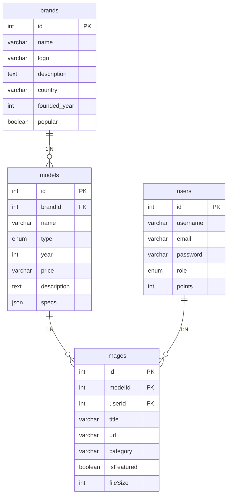
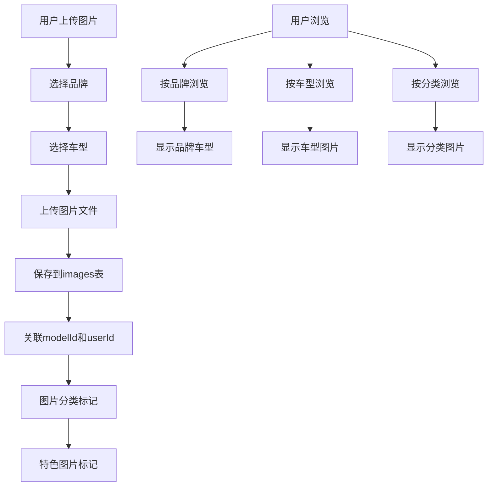
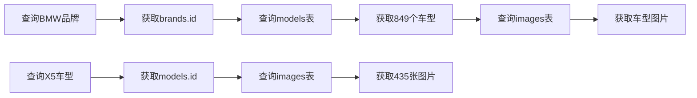

# 数据库核心表架构图

## 📊 表关系概览



## 🔗 外键关系详情

### 1. brands → models
- **关系**: 一对多 (1:N)
- **外键**: `models.brandId` → `brands.id`
- **说明**: 一个品牌可以有多个车型

### 2. models → images  
- **关系**: 一对多 (1:N)
- **外键**: `images.modelId` → `models.id`
- **说明**: 一个车型可以有多张图片

### 3. users → images
- **关系**: 一对多 (1:N)  
- **外键**: `images.userId` → `users.id`
- **说明**: 一个用户可以上传多张图片

## 📋 表结构详情

### brands (品牌表)
```sql
- id (PK): 主键
- name: 品牌名称
- logo: 品牌logo
- description: 品牌描述
- country: 品牌国家
- founded_year: 成立年份
- popular: 是否热门
```

### models (车型表)
```sql
- id (PK): 主键
- brandId (FK): 品牌ID
- name: 车型名称
- type: 车型类型(轿车/SUV/MPV等)
- year: 年份
- price: 价格
- description: 描述
- specs: 规格(JSON)
```

### images (图片表)
```sql
- id (PK): 主键
- modelId (FK): 车型ID
- userId (FK): 用户ID
- title: 图片标题
- url: 图片URL
- category: 图片分类
- isFeatured: 是否特色
- fileSize: 文件大小
```

## 📈 数据统计

### 当前数据量
- **brands**: 93个品牌
- **models**: 6,289个车型  
- **images**: 201,204张图片

### 关系示例
- **BMW**: 849个车型
- **Audi**: 600个车型
- **RAM 2019 RAM 1500**: 435张图片
- **BMW 2019 BMW X5 G05**: 435张图片

## 🎯 业务逻辑

1. **品牌管理**: 支持汽车品牌的基本信息管理
2. **车型分类**: 按品牌组织车型，支持多种车型类型
3. **图片管理**: 每个车型可以有多张图片，支持分类和特色标记
4. **用户上传**: 用户可以上传图片到指定车型

## 🔧 索引优化

### 主要索引
- `brands.id` (主键)
- `models.brandId` (外键索引)
- `models.id` (主键)
- `images.modelId` (外键索引)
- `images.userId` (外键索引)

### 查询优化
- 品牌车型查询: 通过brandId快速查找
- 车型图片查询: 通过modelId快速查找
- 用户图片查询: 通过userId快速查找

## 📊 数据流程图



## 🗂️ 查询示例


